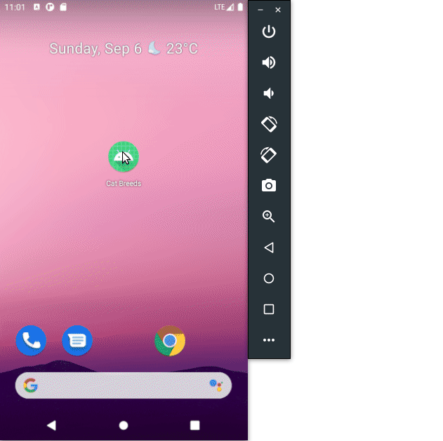
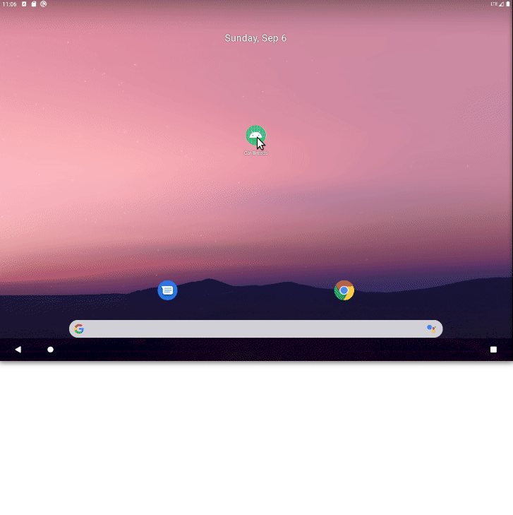

# Cat Breeds App

This is a simple Master/detail app that uses the [theCatApi] to show a list of cat breeds, and when clicked, will show the details of that breed.

---
### Tech
* [Kotlin]
* MVVM Architecture
* Repository Pattern
* [Retrofit]
* [Moshi]
* [Glide]
* [Koin]
* [Coroutines]
* [ViewModel]
* [LiveData]
* [Databinding]
* [Mockk]
* [Espresso]

---
### Architecture
This project has been developed using a MVVM architecture and a Repository pattern, but in this case, only the Remote Data Source was used.

---
### Preview

[theCatApi]: <https://thecatapi.com/>
[Kotlin]: <https://kotlinlang.org/>
[Retrofit]: <https://github.com/square/retrofit>
[Moshi]: <https://github.com/square/moshi/>
[Glide]: <https://github.com/bumptech/glide>
[Koin]: <https://github.com/InsertKoinIO/koin>
[Coroutines]: <https://github.com/Kotlin/kotlinx.coroutines>
[ViewModel]: <https://developer.android.com/topic/libraries/architecture/viewmodel>
[LiveData]: <https://developer.android.com/topic/libraries/architecture/livedata>
[Databinding]: <https://developer.android.com/topic/libraries/data-binding>
[Mockk]: <https://mockk.io/>
[Espresso]: <https://developer.android.com/training/testing/espresso>
